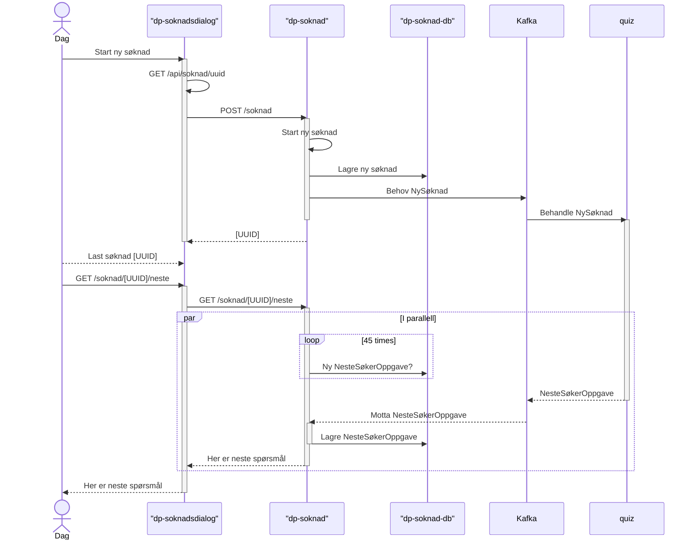

# Sekvensdiagram 

Søknadsdialog, starte og besvare søknad

```mermaid
sequenceDiagram
    actor Dag
    participant frontend as "dp-soknadsdialog"
    participant soknad as "dp-soknad"
    participant soknad_db as "dp-soknad-db"
    participant Kafka

Dag ->> frontend: Start ny søknad
activate frontend
frontend ->> frontend: GET /api/soknad/uuid
frontend ->> soknad: POST /soknad
activate soknad
soknad ->> soknad: Start ny søknad
soknad ->> soknad_db: Lagre ny søknad
soknad ->> Kafka: Behov NySøknad
Kafka ->> quiz: Behandle NySøknad
activate quiz
deactivate soknad
soknad -->> frontend: [UUID]
deactivate frontend

Dag -->> frontend: Last søknad [UUID]
Dag ->> frontend: GET /soknad/[UUID]/neste
activate frontend
frontend ->> soknad: GET /soknad/[UUID]/neste
activate soknad

par I parallell
loop 45 times
soknad ->> soknad_db: Ny NesteSøkerOppgave?
end

quiz -->> Kafka: NesteSøkerOppgave
deactivate quiz
Kafka -->> soknad: Motta NesteSøkerOppgave
activate soknad
soknad ->> soknad_db: Lagre NesteSøkerOppgave
deactivate soknad
soknad -->> frontend: Her er neste spørsmål
deactivate soknad
end

frontend -->> Dag: Her er neste spørsmål
deactivate frontend

```