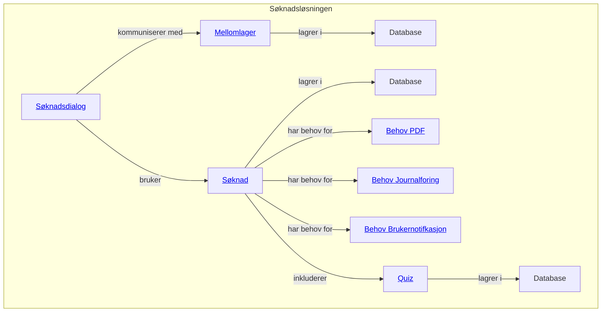

## Komponenter i søknadsdialogen

```mermaid
graph TD
subgraph "Søknadsløsningen"
soknadsdialog[<a href='https://github.com/navikt/dp-soknadsdialog'>Søknadsdialog</a>]
soknad[<a href='https://github.com/navikt/dp-soknad'>Søknad</a>]
soknadDb["Database"]
quiz[<a href='https://github.com/navikt/dp-quiz'>Quiz</a>]
quizDb["Database"]
mellomlager[<a href='https://github.com/navikt/dp-mellomlagring'>Mellomlager</a>]
mellomlagerDb["Database"]
behovPdf[<a href='https://github.com/navikt/dp-behov-soknad-pdf'>Behov PDF</a>]
behovJournalforing[<a href='https://github.com/navikt/dp-behov-journalforing'>Behov Journalforing</a>]
behovBrukernotifikasjon[<a href='https://github.com/navikt/dp-behov-brukernotifikasjon'>Behov Brukernotifkasjon</a>]
end

soknadsdialog -->|bruker| soknad
soknadsdialog -->|kommuniserer med| mellomlager
mellomlager -->|lagrer i| mellomlagerDb
soknad -->|lagrer i| soknadDb
soknad -->|har behov for| behovPdf
soknad -->|har behov for| behovJournalforing
soknad -->|har behov for| behovBrukernotifikasjon
soknad -->|inkluderer| quiz
quiz -->|lagrer i| quizDb

```